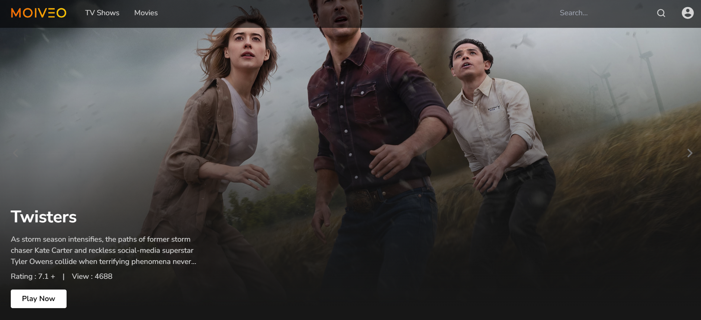
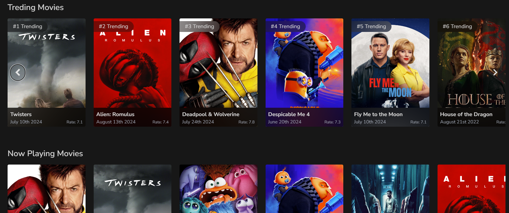
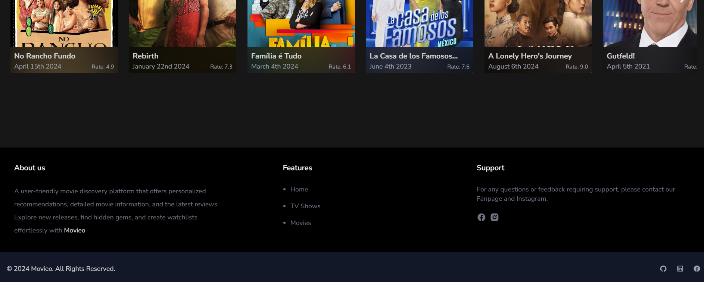
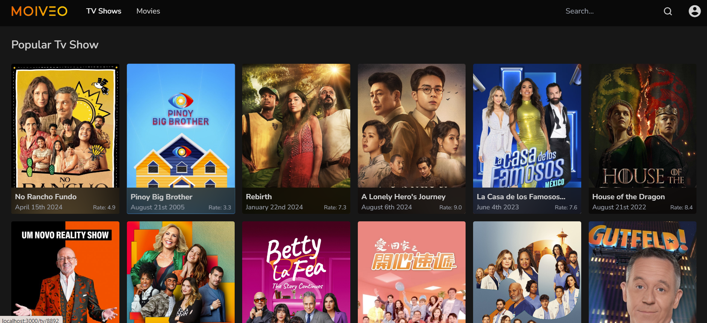
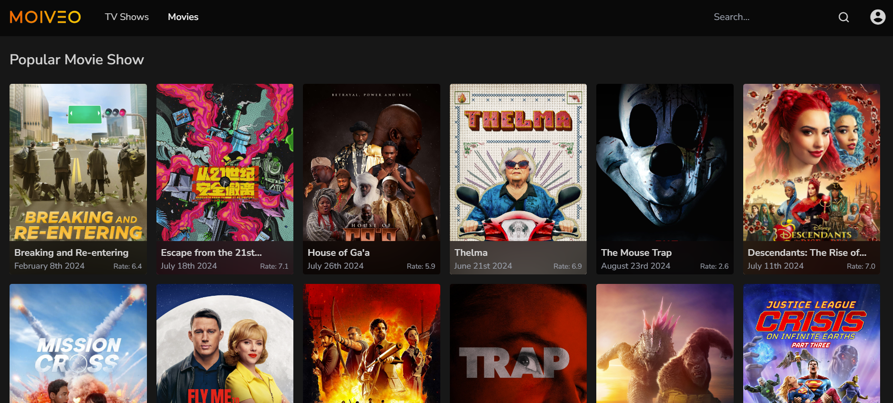
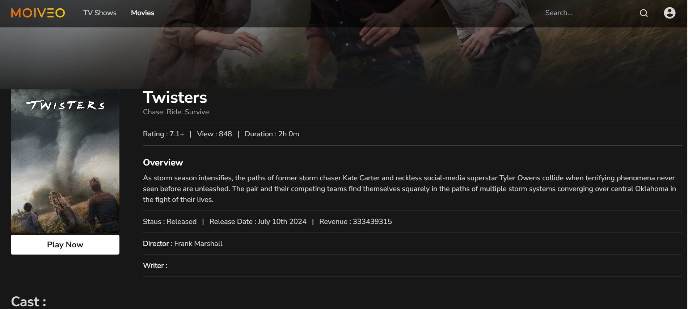
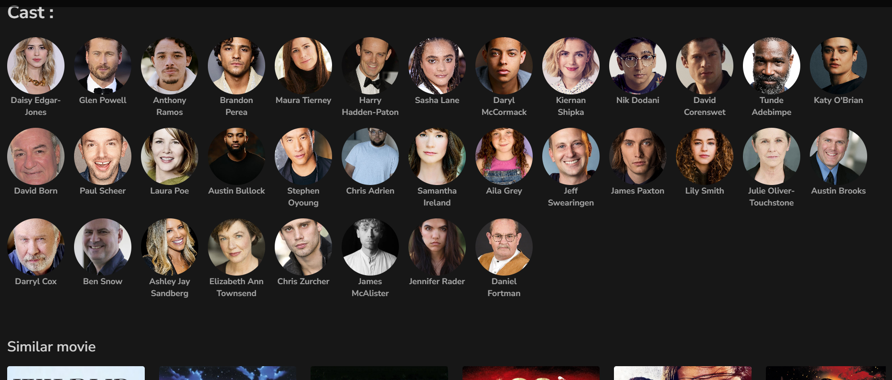
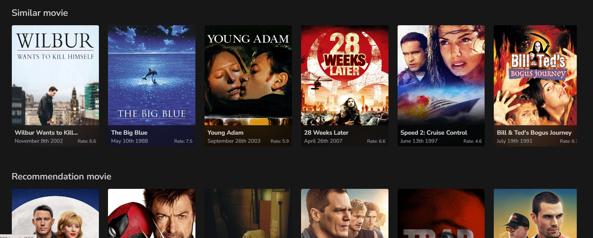
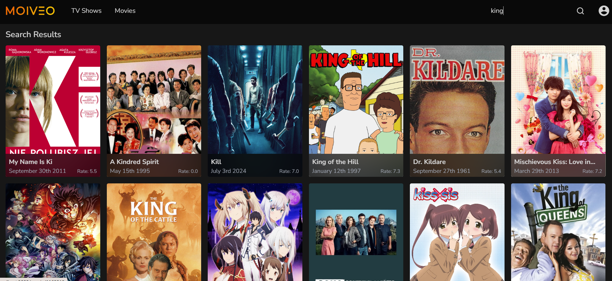

# MOIVEO

Your ultimate movie destination. Discover, watch, and engage with the best movies and a vibrant community of movie enthusiasts. Lights, camera, action!

## Features

- User-Friendly Interface.
- Diverse Range of Movie Options.
- Search Functionality.
- Explore top trending movies.
- View movie details.
- View trailer details.

## Requirement
- Runtime environment:
    - Node.js 20.10.0+.
    - Vercel for hosting.

- Development environment:
    - Node.js 20.10.0+.
    - React.js 18.2.0+ for frontend development.
    - Tailwind CSS for styling.

## Installation Guide

To install and run the project locally, follow these steps:

1. Clone this repo.
2. Run `npm install` to install the dependencies.
3. Run `npm run dev` to start the server.

## User Guide

You can simply click this [link](https://moiveo-one.vercel.app/) to get started.

## User Interface

## Authors

[Lê Quốc Dũng](https://github.com/DungLe2983)
